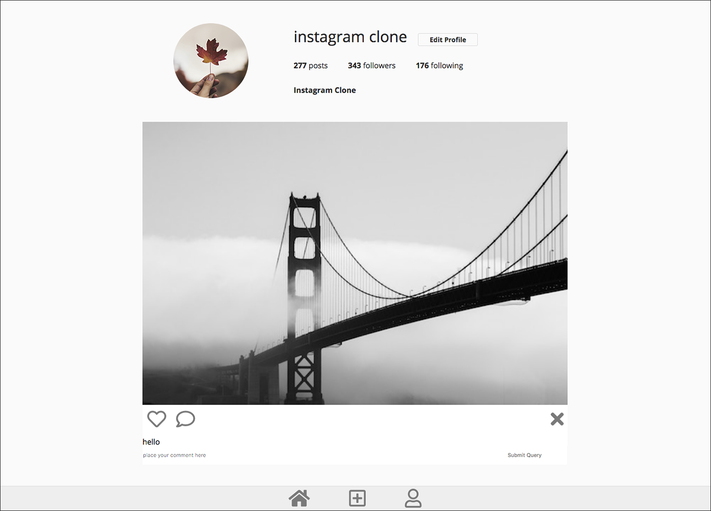
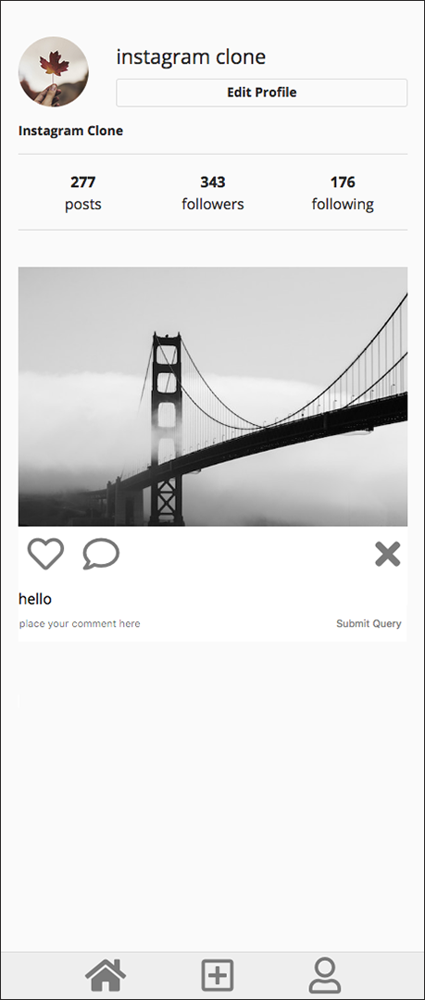
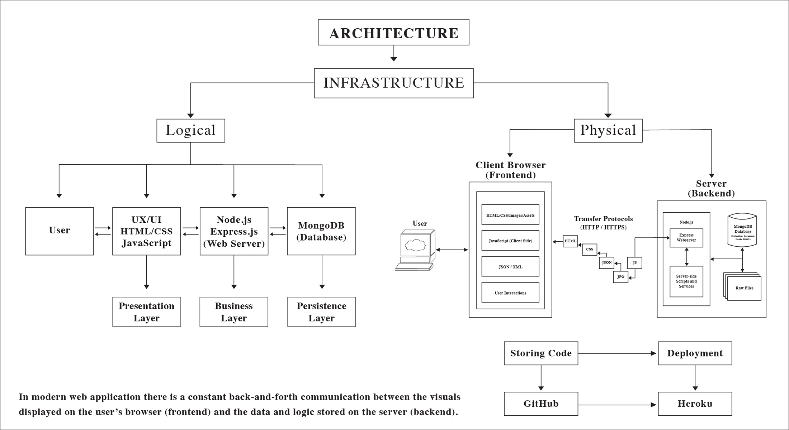
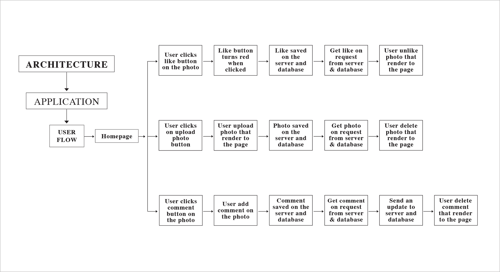
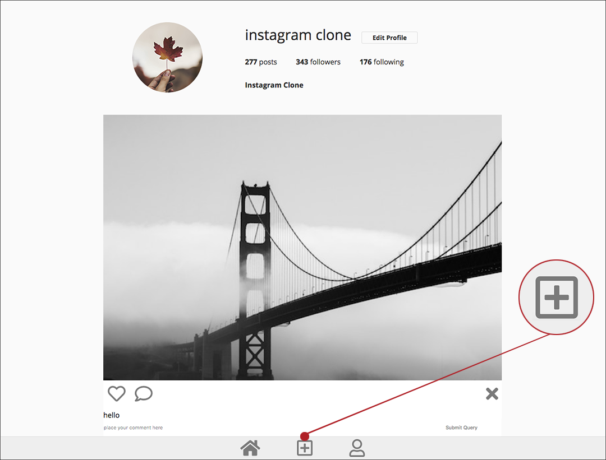
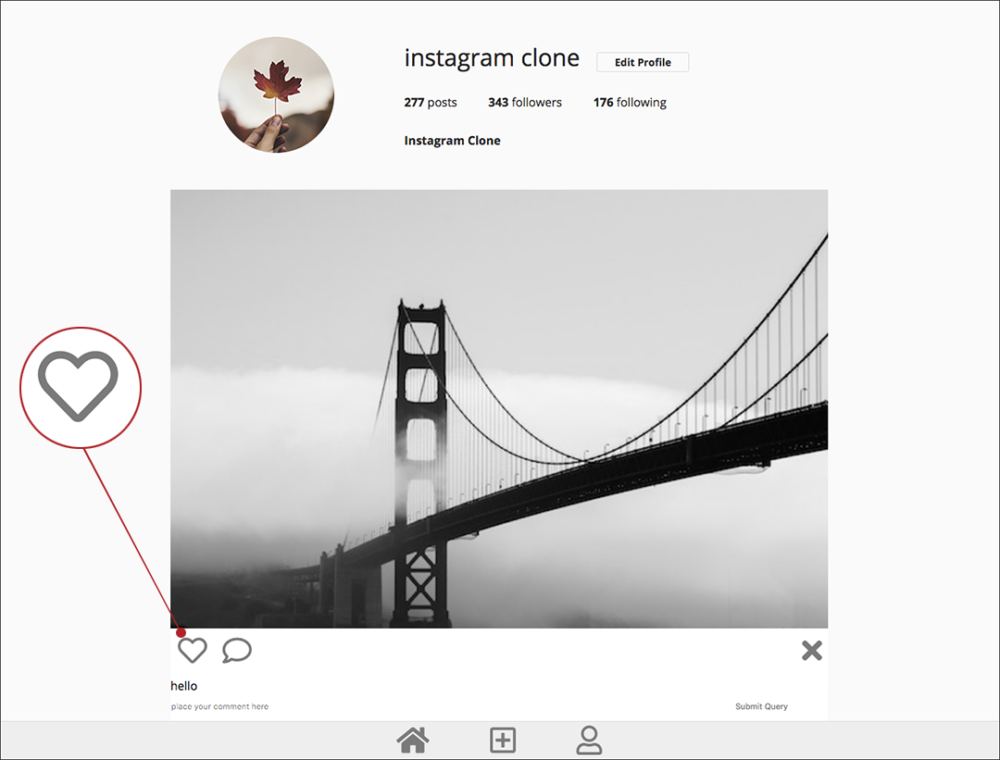
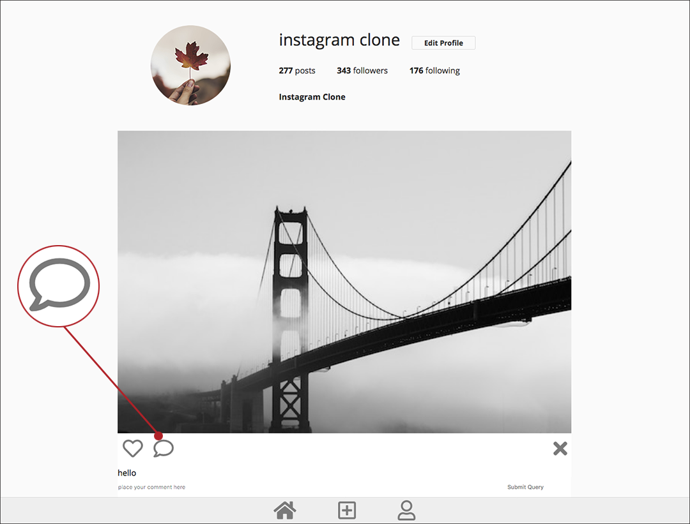

# Instagram Clone

Instagram Clone is a full-stack application, built in collaboration with Gina Yi, Veronica Lee, Juliana Tyler and Mandeep Kaur. Our team chose this project because we wanted to built something we love. The intent of this project was to create a clone of Instagram, a photo sharing app with features of upload, like and comment the photos.

# Project Requirements

## Build an MVP with following functionalities.

1. Ability to upload and delete photos.
2. Ability to like and unlike photos.
3. Ability to add comments to photos.

# Technology Requirements

### HTML, CSS, JavaScript, Node.js, Express, MongoDB, GitHub, Heroku

# Lead Engineer: Mandeep Kaur

## Responsibilities:

1. Set up and configured GitHub repo.
2. Created all database models.
3. Set up a get, post, put, and delete route for all resources.
4. Managed deployment.
5. Turned MVP functionalities to granular stories, opened "Issues" to track the progress.
6. Created the basic stylesheet for the application (grid, color, font, graphic assets).
    
    
7. Architecture plan for the application using a components diagram.
    
    
    

# MVP

Each team member participated in a daily scrum, owned 1 user story.

# Team Member: Gina Yi

## Responsibility: Built a feature with functionality that upload and delete photos.

### Granular Stories:
1. Uploaded photos that render to the page.
2. Saved photos on the server and database.
3. Get photos from the server and database.
4. Deleted photos that render to the page.

# Team Member: Veronica Lee

## Responsibility: Built a feature with functionality that like and unlike photos.

### Granular Stories:
1. Liked photos and recognized when like button is clicked.
2. Saved likes on the server and database.
3. Get likes from the server and database.
4. Unliked photos update on the server and database.

# Team Member: Juliana Tyler

## Responsibility: Built a feature with functionality that add comments to photos.

### Granular Stories:

1. Added comments to photos that render to the page.
2. Saved comments on the server and database.
3. Get comments from the server and database.

# Next Steps

## Adding additional functionality.

1. Multi-user functionality.
2. Ability to applying filters.
3. Ability to follow other users.
4. Ability to add stories.
5. Ability to DM users.

# Deployed Project On Heroku

### https://instagramcloneproject.herokuapp.com/
